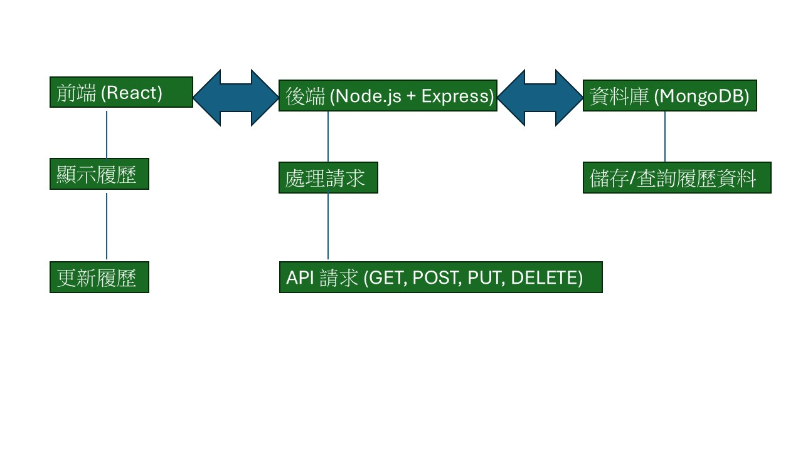
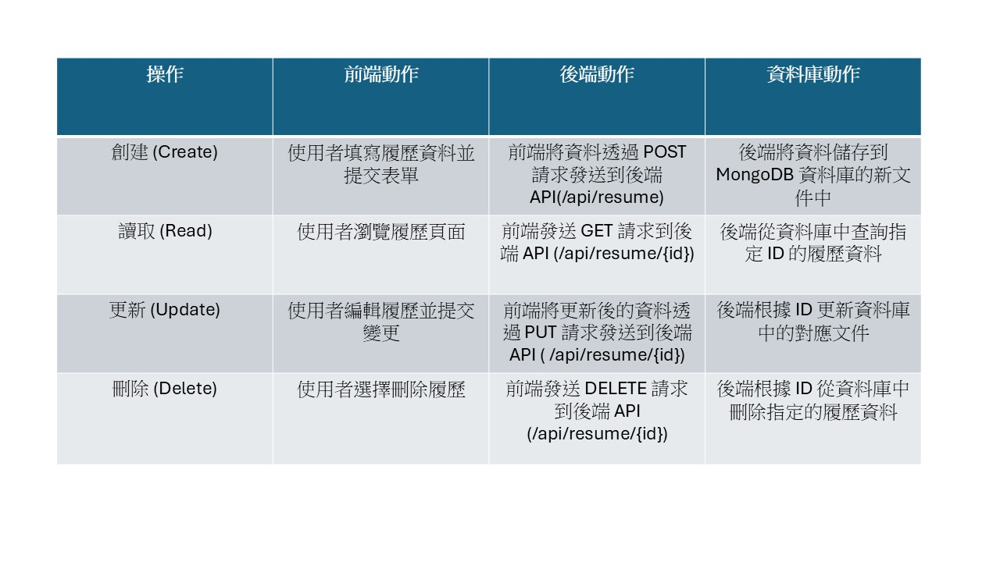

# 履歷網站 (Resume Website)

這是一個使用 HTML、CSS 和 JavaScript 建立的簡單履歷網站。該網站允許使用者輸入個人資料、學歷、工作經歷、技能和專案。網站具有互動性，使用者可以根據提供的欄位自訂內容。

## 功能

- **個人資料**：輸入欄位供使用者填寫姓名、電子郵件和電話。
- **學歷**：文字區域供使用者輸入學歷內容。
- **經歷**：文字區域供使用者輸入工作經歷。
- **技能**：文字區域供使用者列出技能。
- **專案**：文字區域供使用者列出專案。
- **互動按鈕**：提供「完成!」按鈕，點擊後會顯示簡單的提示訊息。

## 使用技術

- **HTML**：用於網站的結構和內容。
- **CSS**：用於網站的樣式和視覺效果。
- **JavaScript**：用於增強互動性，例如按鈕點擊功能。

## 架構與流程圖

## 分工，貢獻度
楊竣安: 查資料 ，設計程式，製作ppt，60%
陳奕嘉: 查資料 ，設計程式，報告，40%
戴侑玲: 0%
